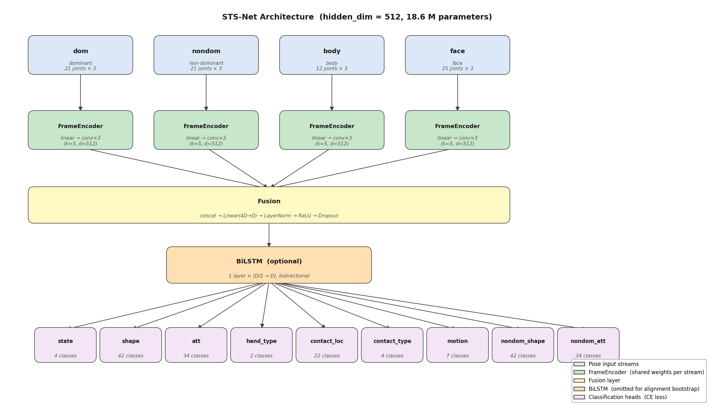

# STS-Net

Per-frame multi-head sign language phonology model for Swedish Sign Language (STS).
Predicts nine phonological features simultaneously from MediaPipe pose streams:

| Head | Labels |
|------|--------|
| state | rest / prep / sign / retract |
| shape | 42 dominant handshapes |
| att | 34 attitude (orientation) slugs |
| hand_type | one / two |
| contact_loc | 22 contact locations |
| contact_type | 4 contact types |
| motion | 7 motion directions |
| nondom_shape | 42 non-dominant handshapes |
| nondom_att | 34 non-dominant attitudes |

## Architecture



Each pose stream (dominant hand, non-dominant hand, body, face) is encoded independently
by a shared-weight `FrameEncoder` (linear projection → 3 × temporal conv blocks).
The four stream representations are concatenated and fused through a linear layer + LayerNorm.
An optional BiLSTM adds temporal context. Nine linear heads produce per-frame predictions.

During the alignment bootstrap (training rounds 1–N) the BiLSTM is omitted — peakier
frame-level emissions produce sharper Viterbi boundaries. The final model adds the BiLSTM
for smoother per-frame inference.

## Installation

```bash
git clone git@github.com:jbeskow/stsnet.git
cd stsnet
git lfs pull                          # download checkpoint (~213 MB)
pip install -e .
```

Requires Python 3.10+, PyTorch 2.0+, and [pose-format](https://github.com/sign-language-processing/pose-format).

---

## Quick start: run the base model

The pretrained checkpoint (`checkpoints/stsnet_base.pt`) was trained on SSLL using
the cold-start recipe below.

### Per-frame predictions

```bash
python scripts/predict.py path/to/clip.pose \
    --ckpt checkpoints/stsnet_base.pt \
    --device cuda
```

Output (truncated):

```
frame  state  shape         att                     hand_type  ...
-----  -----  ------------  ----------------------  ---------
0      rest   Flata handen  vänsterriktad-nedåtvänd  one
1      rest   Flata handen  vänsterriktad-nedåtvänd  one
6      prep   Flata handen  vänsterriktad-nedåtvänd  one
...
```

Select specific heads with `--heads`:

```bash
python scripts/predict.py clip.pose --heads state shape att
```

Print a frame range with `--start` / `--end`:

```bash
python scripts/predict.py clip.pose --start 10 --end 40
```

### Viterbi alignment

Given a sign description and the signing window boundaries (from `pseudo_signing.json`):

```bash
python scripts/predict.py clip.pose \
    --ckpt checkpoints/stsnet_base.pt \
    --description "Flata handen, vänsterriktad och nedåtvänd, upprepade kontakter med hjässan" \
    --sign_start 12 --sign_end 58
```

Output:

```
label         start  end
------------  -----  ---
rest          0      12
__prep__      12     17
Flata handen  17     49
__retract__   49     58
rest          58     72
```

### Python API

```python
from stsnet.inference import STSNetInference

model = STSNetInference("checkpoints/stsnet_base.pt", device="cuda")

# Per-frame label strings for all heads
preds = model.predict_clip_decoded("clip.pose")
# {"state": ["rest", "rest", ..., "prep", ...], "shape": [...], ...}

# Viterbi segmentation
segs = model.align_clip(
    "clip.pose",
    description="Flata handen, vänsterriktad och nedåtvänd",
    sign_start=12,
    sign_end=58,
)
# [("rest", 0, 12), ("__prep__", 12, 17), ("Flata handen", 17, 49), ...]
```

---

## Cold-start training

The full pipeline trains from scratch using only the SSLL dataset (mp4 videos + metadata CSV).
No pre-trained models or existing alignments are needed.

### Prerequisites

- SSLL dataset: `sign_data.csv`, mp4 videos, and a corresponding `signer_map.csv`
  (maps video filenames to signer IDs; see `data/signer_map.csv` for the format)
- Edit `config/default.yaml` to set `data.csv_path`, `data.pose_dir`, `data.cache_dir`

### Step 0 — Extract pose files

```bash
python scripts/extract_pose.py \
    --csv_path  /path/to/SSLL/sign_data.csv \
    --video_dir /path/to/SSLL \
    --pose_dir  /path/to/SSLL/pose \
    --workers   4
```

This runs MediaPipe Holistic via `video_to_pose` on every clip listed in the CSV.
Already-extracted files are skipped, so it is safe to re-run.

### Step 1 — Cache pose arrays (optional, speeds up training)

```bash
python scripts/cache_poses.py \
    --pose_dir  /path/to/SSLL/pose \
    --cache_dir /path/to/SSLL/pose_cache
```

### Step 2 — Compute sign windows

```bash
python scripts/generate_pseudo_signing.py \
    --csv_path  /path/to/SSLL/sign_data.csv \
    --cache_dir /path/to/SSLL/pose_cache \
    --out       pseudo_signing.json
```

This detects prep/retract boundaries heuristically from wrist velocity profiles,
producing a JSON file with per-clip sign windows used by the recipe.

### Step 3 — Run the full recipe

```bash
python scripts/recipe.py --gpu 0
```

The recipe runs automatically:

| Round | Action |
|-------|--------|
| 0 | Generate seed alignment (heuristic prep/retract + equal-split shapes) |
| 1–N | Train STSNet (no BiLSTM) → re-align with multi-head Viterbi → repeat until Δ mIoU < 0.005 |
| Final | Train STSNet (BiLSTM) on converged alignment |

Progress is logged in real time to `runs/recipe_progress.log`:

```
[07:58:08] Seed alignment: 18732 clips written
[07:58:10]   seed: 2ph mIoU=0.690  3ph mIoU=0.538  ALL mIoU=0.609  MAE=3.1f  n=88/100
[07:58:10] Round 1: train noBiLSTM → align
...
```

Checkpoints are saved to `checkpoints/stsnet_recipe/`.

### Step 4 — Evaluate alignment

```bash
python scripts/evaluate.py checkpoints/stsnet_recipe/align_recipe_final_bilstm.csv \
    --annotations data/annotations2.json \
    --test_list   data/test_list2.json
```

### Base model performance

Trained on SSLL with the cold-start recipe (val set, final BiLSTM checkpoint):

| Head | Val accuracy |
|------|-------------|
| state | 0.973 |
| shape | 0.816 |
| att | 0.766 |
| hand_type | 0.959 |
| contact_loc | 0.778 |
| contact_type | 0.704 |
| motion | 0.654 |
| nondom_shape | 0.856 |
| nondom_att | 0.778 |

Alignment on 100-clip test set: mIoU = 0.609 (seed) → converged after 3 rounds.

---

## Repository layout

```
stsnet/               importable package
  model.py            STSNet model definition
  encoder.py          FrameEncoder (temporal conv + optional BiLSTM)
  viterbi.py          blank-free Viterbi forced alignment
  inference.py        STSNetInference API
  train_utils.py      loss, accuracy, data collation helpers
  data/
    pose_io.py        MediaPipe pose loading and normalization
    description.py    Swedish sign description parser
    contact.py        contact location/type vocabulary
    multihead.py      SSLLMultiHeadDataset (per-frame label dataset)
    align_dataset.py  STSAlignDataset + multi-head emission builder
scripts/
  predict.py          run inference on a .pose file
  train.py            train a single model
  align.py            re-align a dataset with a trained checkpoint
  evaluate.py         score alignment against manual annotations
  recipe.py           full cold-start training recipe
  extract_pose.py     extract MediaPipe pose from mp4 files
  generate_pseudo_signing.py  compute sign windows from pose
  make_seed_alignment.py      generate initial equal-split alignment
checkpoints/
  stsnet_base.pt      pretrained base model (Git LFS)
data/
  signer_map.csv      video_id → signer mapping
  sts_handformer.txt  handshape vocabulary (42 classes)
  annotations2.json   100-clip manual boundary annotations (test set)
  test_list2.json     test set clip list
config/
  default.yaml        all hyperparameters
tests/
  test_viterbi.py     unit tests for ctc_forced_align
```
