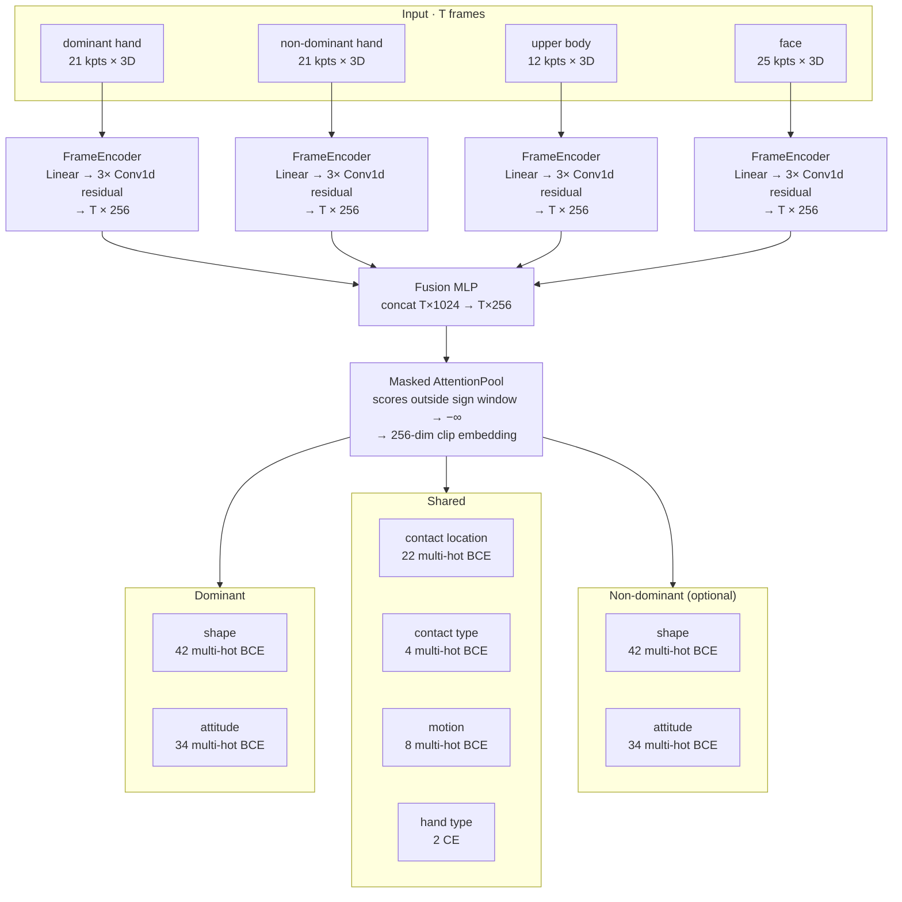

# STS-Net

Phonological property prediction for Swedish Sign Language (STS) from pose keypoints.

**Current version: v0.2** — clip-level attention-pooled model (`ClipClassifier`).
For the v0.1 per-frame BiLSTM model see [README_v01.md](README_v01.md).

---

## What it predicts

Eight phonological properties, trained from **per-clip labels** and queryable
**per frame** at inference (see [Python API](#python-api)):

| Head | Target | Classes |
|------|--------|---------|
| shape (dom.) | multi-hot BCE | <details><summary>42 handshapes</summary>Flata handen · D-handen · Flata tumhanden · Sprethanden · 4-handen · Vinkelhanden · Tumvinkelhanden · A-handen · S-handen · Klohanden · O-handen · Knutna handen · E-handen · Tumhanden · Pekfingret · L-handen · Raka måtthanden · Nyphanden · Nyphanden (alt) · T-handen · Krokfingret · Måtthanden · Hållhanden · Långfingret · N-handen · Lilla O-handen · Lilla O-handen (alt) · V-handen · Tupphanden · K-handen · Dubbelkroken · Böjda tupphanden · M-handen · W-handen · Lillfingret · U-handen · Flyghanden · Stora långfingret · Runda långfingret · Stora nyphanden · Stora hållhanden · X-handen</details> |
| att (dom.) | multi-hot BCE | <details><summary>34 orientations</summary>framåtriktad-framåtvänd · framåtriktad-högervänd · framåtriktad-inåtvänd · framåtriktad-nedåtvänd · framåtriktad-uppåtvänd · framåtriktad-vänstervänd · högerriktad-framåtvänd · högerriktad-högervänd · högerriktad-inåtvänd · högerriktad-nedåtvänd · högerriktad-uppåtvänd · högerriktad-vänstervänd · inåtriktad-högervänd · inåtriktad-inåtvänd · inåtriktad-nedåtvänd · inåtriktad-uppåtvänd · inåtriktad-vänstervänd · nedåtriktad-framåtvänd · nedåtriktad-högervänd · nedåtriktad-inåtvänd · nedåtriktad-nedåtvänd · nedåtriktad-uppåtvänd · nedåtriktad-vänstervänd · uppåtriktad-framåtvänd · uppåtriktad-högervänd · uppåtriktad-inåtvänd · uppåtriktad-uppåtvänd · uppåtriktad-vänstervänd · vänsterriktad-framåtvänd · vänsterriktad-högervänd · vänsterriktad-inåtvänd · vänsterriktad-nedåtvänd · vänsterriktad-uppåtvänd · vänsterriktad-vänstervänd</details> |
| contact_loc | multi-hot BCE | <details><summary>22 locations</summary>none · mouth · chin · nose · forehead · cheek · ear · top_of_head · face · head · neck · chest · stomach · hip · shoulder · upper_arm · forearm · elbow · wrist · other_hand · temple · back</details> |
| contact_type | multi-hot BCE | <details><summary>4 types</summary>none · single · repeated · sustained</details> |
| motion | multi-hot BCE | <details><summary>8 directions</summary>none · nedåt · uppåt · framåt · bakåt · åt_höger · åt_vänster · inåt</details> |
| hand_type | CE | <details><summary>2 classes</summary>one · two</details> |
| nondom_shape | multi-hot BCE | <details><summary>42 handshapes (optional)</summary>Same vocabulary as shape (dom.)</details> |
| nondom_att | multi-hot BCE | <details><summary>34 orientations (optional)</summary>Same vocabulary as att (dom.)</details> |

Training uses one multi-hot target per clip — all properties that appear across
any phase of the sign are active. At inference the same heads can be applied to
individual frames, making it possible to track how predictions evolve through a
sign or to scan continuous video without pre-defined boundaries.

## Architecture



Each stream passes through a `FrameEncoder` (linear projection → LayerNorm + ReLU → 3 × temporal Conv1d with residual connections). The four 256-dim per-frame outputs are concatenated and fused by a linear MLP, then aggregated by **masked attention pooling** — attention scores outside the annotated sign window are forced to −∞, so the pooled embedding represents only the core signing portion. Eight classification heads operate on the 256-dim clip embedding; the two non-dominant heads are optional and enabled at training time.

Optional additional streams: WiLoR 3D MANO joints (`wilor_dom`, `wilor_nondom`),
DINOv2 CLS tokens (`dino`), Moryossef rotation-normalised hands (`dom_norm`, `nondom_norm`),
or a Sapiens whole-body stream in place of MediaPipe.

Total parameters: ~4.3 M.

## Installation

```bash
git clone git@github.com:jbeskow/stsnet.git
cd stsnet
git lfs pull          # download v0.1 checkpoint (~213 MB) if needed
pip install -e .
```

Requires Python 3.10+, PyTorch 2.0+, and [pose-format](https://github.com/sign-language-processing/pose-format).

---

## Python API

Although the model is **trained clip-level** (one prediction per sign), at
inference you can choose between clip-level and per-frame prediction modes.

```python
from stsnet import ClipClassifierInference

model = ClipClassifierInference("checkpoints/stsnet_v02.pt", device="cuda")
```

### Clip-level prediction (one label set per sign)

The attention pool aggregates frame features over the sign window into a single
256-dim embedding, and the heads predict one label per property:

```python
props = model.predict_phonology("clip.pose", sign_start=12, sign_end=58)
# {"shape": "Flata handen", "att": "vänsterriktad-nedåtvänd",
#  "cloc": "none", "ctype": "none", "motion": "none",
#  "hand_type": "one", "nondom_shape": "...", "nondom_att": "..."}
```

`sign_start` / `sign_end` are optional — if omitted, attention spans the whole clip.

### Per-frame prediction (one label set per frame)

The same classification heads are applied directly to the pre-pool per-frame
features, producing a label at every frame. Useful for visualising how
predictions evolve through a sign, or for scanning continuous video without
pre-defined sign boundaries:

```python
frames = model.predict_frames("continuous_video.pose")
# {"shape":  ["Flata handen", "Flata handen", ..., "Krokfingret", ...],
#  "att":    [...],
#  "motion": [...],
#  ...}   # one entry per frame, length = T
```

### Per-frame feature vectors

Raw 256-dim encoder features before pooling — suitable as input to a downstream
segmentation or sign-spotting head:

```python
feats = model.frame_features("continuous_video.pose")
# np.ndarray shape (T, 256)
```

### Clip embedding

256-dim pooled embedding for retrieval or clustering:

```python
emb = model.embed_clip("clip.pose", sign_start=12, sign_end=58)
# np.ndarray shape (256,)
```

---

## Training

### Prerequisites

- SSLL dataset: `sign_data_with_signer_fr.csv`, `.pose` files, `pseudo_signing.json`
  (see [README_v01.md](README_v01.md) for pose extraction and pseudo-signing steps)
- Pose cache built with `cache_poses.py` (see CLAUDE.md)

### Train on SSLL only

```bash
CUDA_VISIBLE_DEVICES=0 conda run -n slp python -u scripts/train_clip.py \
    --out runs/clip_v02
```

Key options:

| Flag | Default | Description |
|------|---------|-------------|
| `--streams` | `dom nondom body face` | Input streams to use |
| `--hidden_dim` | 256 | Encoder channel width |
| `--epochs` | 60 | Training epochs |
| `--dropout` | 0.2 | Dropout rate |
| `--no_z` | off | Use 2D (xy) pose only |
| `--nondom_shape_head` | off | Enable non-dominant handshape head |
| `--nondom_att_head` | off | Enable non-dominant attitude head |
| `--ckpt` | None | Warm-start encoders from v0.1 checkpoint |
| `--wilor_dir` | None | Add WiLoR 3D hand streams |
| `--dino_dir` | None | Add DINOv2 CLS token stream |

Checkpoint saved to `runs/clip_v02/best.pt` (includes vocab metadata).

### Mine SSLC and re-train

Transfer phonological labels from SSLL to unannotated continuous-signing data
via nearest-neighbour embedding matching:

```bash
# Step 1: mine SSLC
CUDA_VISIBLE_DEVICES=0 conda run -n slp python -u scripts/mine_sslc.py \
    --clip_ckpt runs/clip_v02/best.pt \
    --threshold 0.4 \
    --out runs/sslc_mined.json

# Step 2: re-train with mined data + stronger regularisation
CUDA_VISIBLE_DEVICES=0 conda run -n slp python -u scripts/train_clip.py \
    --out runs/clip_v02_mined \
    --clip_ckpt runs/clip_v02/best.pt \
    --mined_json runs/sslc_mined.json \
    --dropout 0.3 --noise_std 0.02 --label_smoothing 0.1 \
    --time_stretch_min 0.85 --time_stretch_max 1.15
```

Mining selects SSLC gloss windows whose embedding (cosine distance) to the nearest
SSLL training variant is below `--threshold`. Mined instances carry the matched
SSLL phonological targets.

### Performance (MediaPipe baseline, SSLL val set)

| Property | SSLL only | +mined SSLC |
|----------|-----------|-------------|
| Handshape (dom.) | 79.9% | **85.1%** |
| Attitude (dom.) | 75.9% | **79.3%** |
| Contact location | 78.3% | **80.6%** |
| Contact type | 72.3% | **76.8%** |
| Motion direction | 57.4% | **62.4%** |
| Hand type | 96.6% | **97.1%** |
| Handshape (nondom.) | 81.3% | **85.7%** |
| Attitude (nondom.) | — | — |

---

## Repository layout

```
stsnet/                      package
  __init__.py                exports STSNet (v0.1), ClipClassifier (v0.2), both Inference APIs
  clip_classifier.py         ClipClassifier + AttentionPool  ← v0.2 default model
  model.py                   STSNet (per-frame BiLSTM)       ← v0.1
  encoder.py                 FrameEncoder, DinoEncoder, TemporalConvBlock
  inference.py               ClipClassifierInference (v0.2), STSNetInference (v0.1)
  train_utils.py             loss / accuracy helpers
  viterbi.py                 blank-free Viterbi forced alignment (v0.1)
  data/
    pose_io.py               MediaPipe loading, load_wilor_streams, normalize_hand_moryossef
    ssll_clip.py             SSLLClipDataset, collate_clip, load_sapiens_streams
    sslc_mined.py            SSLCMinedDataset (mined SSLC gloss clips)
    description.py           Swedish sign description parser
    contact.py               contact location / type vocabularies
    multihead.py             SSLLMultiHeadDataset (per-frame, used by v0.1)
    align_dataset.py         STSAlignDataset + emission builder (used by v0.1)
scripts/
  train_clip.py              train ClipClassifier v0.2       (stsnet-train-clip)
  mine_sslc.py               mine SSLC via embedding matching (stsnet-mine)
  train.py                   train STSNet v0.1               (stsnet-train)
  predict.py                 per-frame inference on .pose file
  align.py                   re-align a dataset
  evaluate.py                score alignment vs. manual annotations
  recipe.py                  full v0.1 cold-start recipe
  extract_pose.py            extract MediaPipe pose from mp4
  generate_pseudo_signing.py compute sign windows from pose
  make_seed_alignment.py     initial equal-split alignment
checkpoints/
  stsnet_base.pt             v0.1 pretrained checkpoint (Git LFS, ~213 MB)
data/
  sts_handformer.txt         handshape vocabulary (42 classes)
  annotations2.json          100-clip manual boundary annotations (test set)
  test_list2.json            test set clip list
  signer_map.csv             video_id → signer mapping
config/
  default.yaml               v0.1 training hyperparameters
tests/
  test_viterbi.py            unit tests for ctc_forced_align
```

---

## v0.1 model

The v0.1 per-frame BiLSTM model (`STSNet`) predicts nine phonological features
per frame and supports Viterbi forced alignment for timeline annotation.
See [README_v01.md](README_v01.md) for full documentation and the pretrained
checkpoint at `checkpoints/stsnet_base.pt`.
